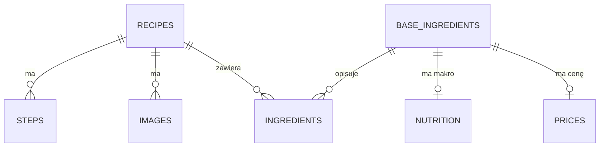

# Uproszczony schemat PostgreSQL dla DinnerTinder

## Cel

Baza ma przechowywać przepisy w formie wygodnej zarówno do wyświetlania
użytkownikowi, jak i do obliczania makro, szacowania ceny oraz filtrowania po
składnikach.

Model rozdziela:

- przepis, jego kroki i zdjęcia;
- tekst składnika widoczny dla użytkownika, np. `300 ml mleka 3,2%`;
- konkretny produkt rozpoznany przez algorytm, np. `mleko 3,2%`;
- ogólną nazwę używaną do filtrowania, np. `mleko`;
- wartości odżywcze produktu na 100 g;
- szacowaną cenę produktu na 100 g.

Docelowy model zawiera siedem tabel:



Relacje:

- jeden przepis ma wiele kroków;
- jeden przepis może mieć wiele zdjęć;
- jeden przepis ma wiele pozycji składników;
- wiele pozycji składników może wskazywać ten sam składnik bazowy;
- jeden składnik bazowy ma maksymalnie jeden profil wartości odżywczych;
- jeden składnik bazowy ma maksymalnie jedną aktualną cenę na 100 g.

Wszystkie klucze główne i obce mają typ `uuid`. Generator finalnego JSON-a
tworzy deterministyczne UUID v8, dzięki czemu ponowne wygenerowanie pliku nie
zmienia istniejących powiązań. Numery stron Wikibooks są zachowane osobno jako
`recipes.source_id`.

## 1. Tabela `recipes`

Przechowuje podstawowe informacje o przepisie. Kroki, zdjęcia i składniki znajdują
się w osobnych tabelach.

| Kolumna | Typ PostgreSQL | Wymagana | Znaczenie |
|---|---|---:|---|
| `id` | `uuid` | tak | Wewnętrzny identyfikator przepisu. |
| `source_id` | `bigint` | tak | Oryginalne ID strony Wikibooks. |
| `name` | `text` | tak | Polska nazwa przepisu. |
| `description` | `text` | nie | Krótki opis przepisu. Obecny JSON nie ma jeszcze osobnego opisu. |
| `time_text` | `text` | nie | Czas w formie do wyświetlenia użytkownikowi. |
| `time_minutes` | `integer` | nie | Łączny czas w minutach do sortowania i filtrowania. |
| `source_url` | `text` | nie | Adres strony źródłowej. |
| `license` | `text` | nie | Licencja tekstu przepisu. |

`time_text` zachowuje oryginalny opis, np. `Przygotowanie: 20 minut, pieczenie:
60 minut`. `time_minutes` jest wartością wtórną, którą będzie można wyliczyć
później.

Mapowanie z `data/ready/wikibooks-recipes-pl-calculable.json`:

| Pole JSON | Kolumna |
|---|---|
| UUID wygenerowany z ID źródłowego | `recipes.id` |
| `recipes[].id` | `recipes.source_id` |
| `recipes[].name` | `recipes.name` |
| brak osobnego pola | `recipes.description` jako `NULL` |
| `recipes[].totalTime` | `recipes.time_text` |
| wynik przyszłego parsera czasu | `recipes.time_minutes` |
| `recipes[].sourceUrl` | `recipes.source_url` |
| `recipes[].license` | `recipes.license` |

## 2. Tabela `steps`

Każdy krok przygotowania jest osobnym rekordem. `step_number` określa kolejność
wyświetlania.

| Kolumna | Typ PostgreSQL | Wymagana | Znaczenie |
|---|---|---:|---|
| `id` | `uuid` | tak | Klucz główny kroku. |
| `recipe_id` | `uuid` | tak | Klucz obcy do `recipes.id`. |
| `step_number` | `integer` | tak | Kolejność kroku, zaczynając od 1. |
| `instruction` | `text` | tak | Polska treść kroku. |

Relacja:

```text
recipes 1 ─── N steps
```

Ograniczenie:

```sql
UNIQUE (recipe_id, step_number)
```

Mapowanie JSON:

```text
recipes[].steps[0] -> step_number = 1
recipes[].steps[1] -> step_number = 2
recipes[].steps[2] -> step_number = 3
```

Usunięcie przepisu powinno usuwać jego kroki przez `ON DELETE CASCADE`.

## 3. Tabela `images`

Przechowuje zdjęcia przypisane do przepisu. Obecny zbiór ma najwyżej jedno
zdjęcie na przepis, ale relacja jeden-do-wielu nie ogranicza aplikacji w
przyszłości.

| Kolumna | Typ PostgreSQL | Wymagana | Znaczenie |
|---|---|---:|---|
| `id` | `uuid` | tak | Klucz główny zdjęcia. |
| `recipe_id` | `uuid` | tak | Klucz obcy do `recipes.id`. |
| `url` | `text` | tak | Bezpośredni URL zdjęcia. |
| `source_url` | `text` | nie | Strona pliku zawierająca źródło i atrybucję. |
| `alt_text` | `text` | nie | Alternatywny opis zdjęcia. |
| `position` | `integer` | tak | Kolejność zdjęcia, zaczynając od 0. |

Relacja:

```text
recipes 1 ─── N images
```

Mapowanie JSON:

| Pole JSON | Kolumna |
|---|---|
| `recipes[].imageUrl` | `images.url` |
| `recipes[].imagePageUrl` | `images.source_url` |
| brak pola | `images.alt_text` jako `NULL` |
| pierwsze zdjęcie | `images.position = 0` |

Jeżeli `imageUrl` jest `NULL`, nie tworzymy rekordu w `images`.

Licencję i autora zdjęcia trzeba później pobrać ze strony `imagePageUrl`. Nie
należy zakładać, że licencja przepisu automatycznie obejmuje zdjęcie.

## 4. Tabela `base_ingredients`

Przechowuje produkt rozpoznany na tyle dokładnie, aby można było przypisać mu
jedno makro na 100 g.

| Kolumna | Typ PostgreSQL | Wymagana | Przykład | Znaczenie |
|---|---|---:|---|---|
| `id` | `uuid` | tak | `00000004-0000-8000-8000-000000001076` | Klucz główny. |
| `key` | `text` | tak | `mleko-3-2` | Unikalny klucz techniczny. |
| `name` | `text` | tak | `mleko 3,2%` | Konkretny produkt używany do makro. |
| `generic_name` | `text` | tak | `mleko` | Podstawowa nazwa do grupowania i filtrowania. |
| `density_g_ml` | `numeric` | nie | `1.03` | Liczba gramów w jednym mililitrze. |
| `grams_per_piece` | `numeric` | nie | `50` | Domyślna masa jednej sztuki. |
| `needs_review` | `boolean` | tak | `false` | Czy produkt wymaga sprawdzenia przed przypisaniem makro. |

Przykładowe rekordy:

| `key` | `name` | `generic_name` |
|---|---|---|
| `mleko-3-2` | mleko 3,2% | mleko |
| `mleko-2` | mleko 2% | mleko |
| `maka-pszenna` | mąka pszenna | mąka |
| `maka-migdalowa` | mąka migdałowa | mąka |
| `jajko-kurze` | jajko kurze | jajko |

`generic_name` umożliwia filtrowanie ogólne:

```sql
SELECT DISTINCT r.*
FROM recipes r
JOIN ingredients i ON i.recipe_id = r.id
JOIN base_ingredients bi ON bi.id = i.base_ingredient_id
WHERE bi.generic_name = 'mleko';
```

Makro musi być przypisane do `name`, a nie tylko do `generic_name`, ponieważ np.
mleko 0,5% i mleko 3,2% mają inne wartości odżywcze.

Mapowanie obecnego JSON-a:

| Pole JSON | Kolumna |
|---|---|
| `ingredients[].nutritionVariant.key` | `base_ingredients.key` |
| `ingredients[].nutritionVariant.name` | `base_ingredients.name` |
| `ingredients[].baseIngredient.name` | `base_ingredients.generic_name` |
| `ingredients[].nutritionVariant.needsReview` | `base_ingredients.needs_review` |

W obecnym JSON-ie `nutritionVariant` oznacza konkretny produkt, a
`baseIngredient` jego ogólną formę. Nazwa tabeli `base_ingredients` odnosi się w
bazie do produktu bazowego dla algorytmu, dlatego jest zasilana przede wszystkim
z `nutritionVariant`.

### Pola do przeliczeń

`density_g_ml` jest potrzebne dla płynów i składników podawanych objętościowo:

```text
gramy = mililitry * density_g_ml
```

`grams_per_piece` jest potrzebne dla produktów liczonych w sztukach:

```text
gramy = liczba_sztuk * grams_per_piece
```

Jeżeli składnik w przepisie ma już podaną masę w gramach, te pola nie są
potrzebne do obliczenia konkretnej pozycji.

## 5. Tabela `nutrition`

Przechowuje wartości odżywcze na 100 g dla konkretnego rekordu z
`base_ingredients`.

| Kolumna | Typ PostgreSQL | Wymagana | Znaczenie |
|---|---|---:|---|
| `base_ingredient_id` | `uuid` | tak | PK i FK do `base_ingredients.id`. |
| `kcal_100g` | `numeric` | tak | Kilokalorie na 100 g. |
| `protein_100g` | `numeric` | tak | Białko na 100 g. |
| `fat_100g` | `numeric` | tak | Tłuszcz na 100 g. |
| `carbs_100g` | `numeric` | tak | Węglowodany na 100 g. |
| `fiber_100g` | `numeric` | nie | Błonnik na 100 g. |
| `source` | `text` | nie | Źródło danych odżywczych. |
| `external_id` | `text` | nie | ID produktu w zewnętrznej bazie. |

Relacja:

```text
base_ingredients 1 ─── 0..1 nutrition
```

`base_ingredient_id` jest jednocześnie kluczem głównym, dlatego jeden składnik
nie może dostać kilku różnych aktywnych profili makro.

Obecne pliki nie zawierają jeszcze uzupełnionych wartości odżywczych. Dane do tej
tabeli trzeba pozyskać z osobnego, wiarygodnego źródła. Nie należy wstawiać zer w
miejsce brakujących wartości.

## 6. Tabela `prices`

Przechowuje aktualną szacowaną cenę 100 g konkretnego produktu z
`base_ingredients`.

| Kolumna | Typ PostgreSQL | Wymagana | Znaczenie |
|---|---|---:|---|
| `base_ingredient_id` | `uuid` | tak | PK i FK do `base_ingredients.id`. |
| `price_100g` | `numeric(12,2)` | tak | Cena 100 g produktu. |
| `currency` | `char(3)` | tak | Kod waluty, domyślnie `PLN`. |
| `source` | `text` | nie | Sklep, API albo inne źródło ceny. |
| `source_url` | `text` | nie | Adres strony potwierdzającej cenę. |
| `updated_at` | `timestamptz` | tak | Data ostatniej aktualizacji. |

Relacja:

```text
base_ingredients 1 ─── 0..1 prices
```

`base_ingredient_id` jest jednocześnie kluczem głównym, dlatego składnik ma
maksymalnie jedną aktualną cenę. Nie przechowujemy jeszcze historii cen ani wielu
sklepów. Aktualizacja ceny zastępuje poprzednią wartość.

Przykład:

```text
base_ingredient_id = '00000004-0000-8000-8000-000000001076'
price_100g          = 0.42
currency            = 'PLN'
source              = 'średnia cena rynkowa'
updated_at          = '2026-07-12T22:00:00Z'
```

Koszt pozycji przepisu:

```text
koszt = quantity_grams / 100 * price_100g
```

Jeżeli cena nie jest znana, rekord w `prices` nie powinien istnieć. Nie należy
wstawiać ceny `0`, ponieważ oznaczałoby to produkt darmowy, a nie brak danych.

Docelowym źródłem może być sekcja `profiles[].price` z
`data/ready/wikibooks-ingredient-profiles-pl.json`, gdy zostanie uzupełniona:

| Pole JSON | Kolumna / przeliczenie |
|---|---|
| `profiles[].variantKey` | wyszukanie `base_ingredients.id` po `key` |
| `price.pricePerKilogram` | `prices.price_100g = pricePerKilogram / 10` |
| `price.currency` | `prices.currency` |
| `price.source` | `prices.source` |
| `price.observedAt` | `prices.updated_at` |

## 7. Tabela `ingredients`

Przechowuje składniki należące do konkretnego przepisu. `displayed_name` jest
tekstem widocznym dla użytkownika, a pozostałe pola służą algorytmowi.

| Kolumna | Typ PostgreSQL | Wymagana | Przykład | Znaczenie |
|---|---|---:|---|---|
| `id` | `uuid` | tak | `00000005-0000-8000-8000-000000000001` | Klucz główny wpisu. |
| `recipe_id` | `uuid` | tak | `00000001-0000-8000-8000-000000004696` | FK do `recipes.id`. |
| `base_ingredient_id` | `uuid` | nie | `00000004-0000-8000-8000-000000001076` | FK do `base_ingredients.id`. |
| `position` | `integer` | tak | `0` | Kolejność na liście. |
| `displayed_name` | `text` | tak | `300 ml mleka 3,2%` | Tekst dla użytkownika. |
| `quantity` | `numeric` | nie | `300` | Liczba w jednostce źródłowej. |
| `unit` | `text` | nie | `ml` | Jednostka, np. `g`, `ml`, `piece`. |
| `quantity_grams` | `numeric` | nie | `309` | Ilość przeliczona na gramy. |
| `optional` | `boolean` | tak | `false` | Czy składnik jest opcjonalny. |
| `needs_review` | `boolean` | tak | `false` | Czy rozpoznanie wymaga sprawdzenia. |

Relacje:

```text
recipes 1 ─── N ingredients
ingredients N ─── 1 base_ingredients
```

`base_ingredient_id` może być `NULL`, jeżeli parser nie rozpoznał produktu.
`displayed_name` musi jednak zawsze pozostać zapisane, dzięki czemu użytkownik
nadal zobaczy kompletny przepis.

Mapowanie JSON:

| Pole JSON | Kolumna |
|---|---|
| indeks w `recipes[].ingredients[]` | `ingredients.position` |
| `ingredients[].text` | `ingredients.displayed_name` |
| `ingredients[].nutritionVariant.key` | wyszukanie `base_ingredients.id` po `key` |
| wybrany `amounts[calculation.amountIndex].valueMin` | `ingredients.quantity` |
| wybrany `amounts[calculation.amountIndex].unit` | `ingredients.unit` |
| `calculation.quantityGramsMin` | `ingredients.quantity_grams` |
| `ingredients[].optional` | `ingredients.optional` |
| flaga pozycji lub wariantu | `ingredients.needs_review` |

Dla zakresu ilości obecny uproszczony model zapisuje wartość minimalną. Jeżeli
zakresy okażą się istotne w aplikacji, można później dodać `quantity_max` i
`quantity_grams_max` bez tworzenia nowej tabeli.

### Przykład: mleko

Tekst dla użytkownika:

```text
300 ml mleka 3,2%
```

Rekord `ingredients`:

```text
displayed_name     = '300 ml mleka 3,2%'
quantity           = 300
unit               = 'ml'
quantity_grams     = 309
base_ingredient_id = '00000004-0000-8000-8000-000000001076'
```

Rekord `base_ingredients`:

```text
id             = '00000004-0000-8000-8000-000000001076'
key            = 'mleko-3-2'
name           = 'mleko 3,2%'
generic_name   = 'mleko'
density_g_ml   = 1.03
```

Rekord `nutrition`:

```text
base_ingredient_id = '00000004-0000-8000-8000-000000001076'
kcal_100g           = 61
protein_100g        = 3.2
fat_100g            = 3.2
carbs_100g          = 4.7
```

Kalorie pozycji:

```text
309 / 100 * 61 = 188.49 kcal
```

### Przykład: jajka

```text
displayed_name = '5 jajek'
quantity       = 5
unit           = 'piece'
```

Jeżeli `base_ingredients.grams_per_piece = 50`, otrzymujemy:

```text
quantity_grams = 5 * 50 = 250 g
```

## Kompletny DDL

```sql
CREATE TABLE recipes (
    id UUID PRIMARY KEY,
    source_id BIGINT NOT NULL UNIQUE,
    name TEXT NOT NULL,
    description TEXT,
    time_text TEXT,
    time_minutes INTEGER CHECK (time_minutes IS NULL OR time_minutes >= 0),
    source_url TEXT,
    license TEXT
);

CREATE TABLE steps (
    id UUID PRIMARY KEY,
    recipe_id UUID NOT NULL REFERENCES recipes(id) ON DELETE CASCADE,
    step_number INTEGER NOT NULL CHECK (step_number > 0),
    instruction TEXT NOT NULL,
    UNIQUE (recipe_id, step_number)
);

CREATE TABLE images (
    id UUID PRIMARY KEY,
    recipe_id UUID NOT NULL REFERENCES recipes(id) ON DELETE CASCADE,
    url TEXT NOT NULL,
    source_url TEXT,
    alt_text TEXT,
    position INTEGER NOT NULL DEFAULT 0 CHECK (position >= 0),
    UNIQUE (recipe_id, position)
);

CREATE TABLE base_ingredients (
    id UUID PRIMARY KEY,
    key TEXT NOT NULL UNIQUE,
    name TEXT NOT NULL,
    generic_name TEXT NOT NULL,
    density_g_ml NUMERIC CHECK (density_g_ml IS NULL OR density_g_ml > 0),
    grams_per_piece NUMERIC CHECK (grams_per_piece IS NULL OR grams_per_piece > 0),
    needs_review BOOLEAN NOT NULL DEFAULT FALSE
);

CREATE INDEX base_ingredients_generic_name_idx
    ON base_ingredients(generic_name);

CREATE TABLE nutrition (
    base_ingredient_id UUID PRIMARY KEY
        REFERENCES base_ingredients(id) ON DELETE CASCADE,
    kcal_100g NUMERIC NOT NULL CHECK (kcal_100g >= 0),
    protein_100g NUMERIC NOT NULL CHECK (protein_100g >= 0),
    fat_100g NUMERIC NOT NULL CHECK (fat_100g >= 0),
    carbs_100g NUMERIC NOT NULL CHECK (carbs_100g >= 0),
    fiber_100g NUMERIC CHECK (fiber_100g IS NULL OR fiber_100g >= 0),
    source TEXT,
    external_id TEXT
);

CREATE TABLE prices (
    base_ingredient_id UUID PRIMARY KEY
        REFERENCES base_ingredients(id) ON DELETE CASCADE,
    price_100g NUMERIC(12,2) NOT NULL CHECK (price_100g >= 0),
    currency CHAR(3) NOT NULL DEFAULT 'PLN',
    source TEXT,
    source_url TEXT,
    updated_at TIMESTAMPTZ NOT NULL DEFAULT now()
);

CREATE TABLE ingredients (
    id UUID PRIMARY KEY,
    recipe_id UUID NOT NULL REFERENCES recipes(id) ON DELETE CASCADE,
    base_ingredient_id UUID REFERENCES base_ingredients(id),
    position INTEGER NOT NULL CHECK (position >= 0),
    displayed_name TEXT NOT NULL,
    quantity NUMERIC CHECK (quantity IS NULL OR quantity >= 0),
    unit TEXT,
    quantity_grams NUMERIC CHECK (quantity_grams IS NULL OR quantity_grams >= 0),
    optional BOOLEAN NOT NULL DEFAULT FALSE,
    needs_review BOOLEAN NOT NULL DEFAULT FALSE,
    UNIQUE (recipe_id, position)
);

CREATE INDEX ingredients_recipe_idx ON ingredients(recipe_id);
CREATE INDEX ingredients_base_ingredient_idx ON ingredients(base_ingredient_id);
```

## Kolejność importu

1. Zaimportować `recipes` z `recipes[]`.
2. Utworzyć `steps` z każdej tablicy `recipes[].steps[]`.
3. Utworzyć `images` dla przepisów mających `imageUrl`.
4. Zbudować unikalne `base_ingredients` na podstawie `nutritionVariant.key`.
5. Utworzyć `ingredients` i połączyć je z `base_ingredients`.
6. Uzupełnić `nutrition` po pozyskaniu wiarygodnych danych makro.
7. Uzupełnić `prices` po pozyskaniu wiarygodnych cen na 100 g.
8. Wyliczyć brakujące `quantity_grams` przy użyciu `density_g_ml` albo
   `grams_per_piece`.

## Finalna baza w jednym pliku JSON

Plik `data/ready/dinnertinder-database.json` odwzorowuje ten sam model bez
konieczności uruchamiania PostgreSQL. Każda tabela jest osobną tablicą na głównym
poziomie dokumentu:

```json
{
  "recipes": [],
  "steps": [],
  "images": [],
  "ingredients": [],
  "base_ingredients": [],
  "nutrition": [],
  "prices": []
}
```

Rekordy mają gotowe UUID w `id`, a relacje wykorzystują pola `recipe_id` i
`base_ingredient_id`. Tablice `nutrition` i `prices` pozostają puste do czasu
pozyskania wiarygodnych wartości. Plik można odtworzyć poleceniem:

```bash
bash scripts/build-json-database.sh
```

Głównym źródłem dla pierwszych pięciu kroków jest:

```text
data/ready/wikibooks-recipes-pl-calculable.json
```

`data/ready/wikibooks-ingredient-profiles-pl.json` jest obecnie tylko pustym
szablonem. Nie należy importować z niego zer ani udawać, że brakujące wartości są
rzeczywistym makro lub ceną.

## Obliczanie makro przepisu

Dla każdej pozycji mającej `quantity_grams` i rekord w `nutrition`:

```text
kcal = quantity_grams / 100 * kcal_100g
białko = quantity_grams / 100 * protein_100g
tłuszcz = quantity_grams / 100 * fat_100g
węglowodany = quantity_grams / 100 * carbs_100g
```

Makro całego przepisu jest sumą wartości wszystkich jego pozycji.

Jeżeli choć jedna pozycja nie ma `quantity_grams`, `base_ingredient_id` albo
profilu `nutrition`, wynik powinien być oznaczony jako niepełny. Brakującego
składnika nie należy po cichu liczyć jako zero.

## Obliczanie kosztu przepisu

Dla każdej pozycji mającej `quantity_grams` i rekord w `prices`:

```text
koszt pozycji = quantity_grams / 100 * price_100g
```

Koszt przepisu jest sumą kosztów jego pozycji. Jeżeli co najmniej jedna pozycja
nie ma ilości w gramach albo ceny, wynik powinien zostać oznaczony jako niepełny.

## Czego świadomie nie dodajemy

Na tym etapie nie tworzymy osobnych tabel na:

- aliasy nazw składników;
- wiele wariantów jednego wpisu przepisu;
- wiele profili makro dla jednego składnika;
- przeliczniki jako osobne rekordy;
- produkty sklepowe i historię cen;
- kolejki importów i rozbudowany staging.

Jeżeli pojawi się rzeczywista potrzeba którejś z tych funkcji, schemat można
rozszerzyć bez zmiany podstawowego powiązania:

```text
ingredients -> base_ingredients -> nutrition
                            └───> prices
```
