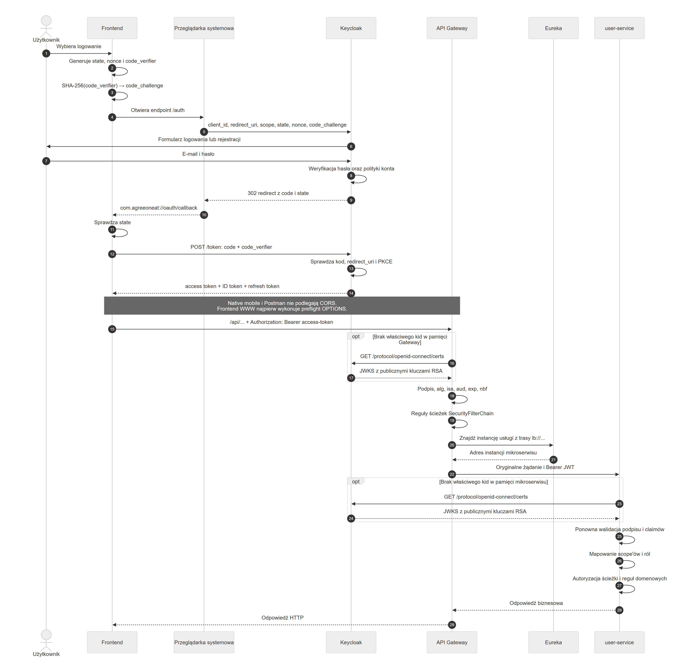

# Przepływy uwierzytelniania i autoryzacji w AgreeOnEat

## Słownik pojęć

### Realm

Realm to wydzielona przestrzeń w Keycloak przechowująca własnych użytkowników, klientów aplikacji, role, sesje oraz zasady logowania. Można go traktować jak osobne środowisko bezpieczeństwa — dane i konfiguracja jednego realmu są odseparowane od pozostałych.

AgreeOnEat korzysta z realmu `agreeoneat`. Oznacza to, że konta użytkowników aplikacji, klient `agreeoneat-mobile` i cała ustalona konfiguracja logowania należą właśnie do tej przestrzeni. Realm `master` służy natomiast do zarządzania samym Keycloak i nie powinien przechowywać zwykłych użytkowników aplikacji.

### PKCE

PKCE (Proof Key for Code Exchange) to mechanizm zabezpieczający proces logowania użytkownika rozpoczęty przez aplikację, która nie może bezpiecznie przechowywać `client_secret` (takie jakby hasło do Keycloak). Aplikacja nadal wysyła publiczny `client_id` (taki jakby login), natomiast PKCE sprawia, że authorization code może wykorzystać tylko urządzenie, które rozpoczęło logowanie.

### OpenID Connect (OIDC)

OAuth 2.0 jest mechanizmem autoryzacji — odpowiada przede wszystkim na pytanie: „Do czego aplikacja może otrzymać dostęp?”. Używa do tego access tokenu, ale sam nie określa standardowego sposobu potwierdzenia, kim jest zalogowany użytkownik.

OpenID Connect jest warstwą logowania i tożsamości zbudowaną na OAuth 2.0. Odpowiada dodatkowo na pytanie: „Kim jest użytkownik?”. Dodaje między innymi ID token (opisuje wynik logowania i tożsamość użytkownika; w przeciwieństwie do access tokenu nie służy do wywoływania API), standardowe informacje o użytkowniku oraz parametr `nonce` (jednorazową losową wartość wiążącą ID token z konkretną próbą logowania).


## Przepływ frontend → mikroserwis biznesowy



### 1. Rozpoczęcie logowania

Użytkownik uruchamia aplikację mobilną i na ekranie powitalnym wybiera przycisk „Zaloguj”.

### 2. Wygenerowanie danych zabezpieczających logowanie

Aplikacja przygotowuje trzy losowe wartości potrzebne tylko podczas tej jednej próby logowania:

| Wartość | Czym jest? | Co chroni? | Najprostsze pytanie kontrolne |
| --- | --- | --- | --- |
| `state` | Losowa wartość dla jednej próby logowania. Frontend zapisuje ją i wysyła do Keycloak, a Keycloak odsyła ją bez zmian razem z authorization code. | Callback z przeglądarki. | „Czy ten callback odpowiada logowaniu, które rozpocząłem?” |
| `nonce` | Druga losowa wartość. Keycloak odsyła ją wewnątrz podpisanego ID tokenu. | ID token. | „Czy ten ID token został wystawiony dla mojego aktualnego logowania?” |
| `code_verifier` | Długi, kryptograficznie losowy sekret jednorazowy używany przez PKCE i przechowywany tymczasowo przez frontend. | Wymianę authorization code na tokeny. | „Czy authorization code wymienia ta sama aplikacja, która rozpoczęła logowanie?” |

Te wartości powstają w aplikacji mobilnej podczas działania programu. Muszą być nowe dla każdej próby logowania i nie mogą być generowane przez `Math.random()`.
W przyszłym frontendzie kod odpowiedzialny za logowanie znajdzie się w wydzielonym module, ale samo bezpieczne losowanie i sprawdzanie tych wartości powierzymy bibliotece OIDC.
Biblioteka wygeneruje `state`, `nonce` i `code_verifier`, tymczasowo przechowa je na urządzeniu oraz wykorzysta po powrocie z przeglądarki.

### 3. Wyliczenie `code_challenge`

Biblioteka OIDC wykorzystuje utworzony wcześniej `code_verifier` do wyliczenia wartości `code_challenge`:

```text
code_challenge = BASE64URL(SHA-256(code_verifier))
```

`code_verifier` pozostaje na urządzeniu i na tym etapie nie jest wysyłany. Do Keycloak zostanie wysłany jedynie `code_challenge`. SHA-256 jest funkcją jednokierunkową, dlatego na podstawie `code_challenge` nie da się w praktyce odzyskać pierwotnego `code_verifier`.

Ten wariant PKCE nazywa się `S256`. Keycloak zapamięta `code_challenge`, aby później — podczas wymiany authorization code na tokeny — sprawdzić przedstawiony przez aplikację `code_verifier`.

### 4. Otwarcie strony logowania

Biblioteka OIDC otwiera systemową przeglądarkę na endpoincie autoryzacji Keycloak. Lokalnie jest to adres:

```text
http://localhost:8081/realms/agreeoneat/protocol/openid-connect/auth
```

Używana jest systemowa przeglądarka, a nie formularz osadzony bezpośrednio w aplikacji. Dzięki temu aplikacja mobilna nie widzi i nie przechwytuje hasła użytkownika — dane logowania trafiają wyłącznie do Keycloak.

Po otwarciu przeglądarki aplikacja oczekuje na późniejszy powrót przez skonfigurowany callback. W środowisku produkcyjnym endpoint Keycloak będzie dostępny przez HTTPS.

### 5. Rozpoczęcie procesu logowania w Keycloak

Systemowa przeglądarka wysyła do endpointu autoryzacji żądanie `GET` z parametrami przygotowanymi przez bibliotekę OIDC. W uproszczeniu adres wygląda następująco:

```text
/auth
  ?response_type=code
  &client_id=agreeoneat-mobile
  &redirect_uri=com.agreeoneat://oauth/callback
  &scope=openid
  &state=<wygenerowany_state>
  &nonce=<wygenerowany_nonce>
  &code_challenge=<wyliczony_code_challenge>
  &code_challenge_method=S256
```

W tej chwili użytkownik nie podaje jeszcze e-maila ani hasła. Logowanie użytkownika nastąpi dopiero w kolejnych krokach.

| Parametr | Skąd pochodzi? | Znaczenie |
| --- | --- | --- |
| `response_type=code` | Stała konfiguracja biblioteki OIDC. | Informuje Keycloak, że po logowaniu ma zwrócić authorization code, a nie token bezpośrednio w adresie. |
| `client_id=agreeoneat-mobile` | Publiczna konfiguracja aplikacji oraz klient zarejestrowany w Keycloak. | Określa, która aplikacja rozpoczyna logowanie. |
| `redirect_uri` | Konfiguracja deep linku aplikacji i lista dozwolonych adresów klienta w Keycloak. | Określa, gdzie Keycloak ma odesłać przeglądarkę po logowaniu. Wartość musi dokładnie pasować do adresu zarejestrowanego w Keycloak. |
| `scope=openid` | Konfiguracja OIDC frontendu. | Włącza OpenID Connect, dzięki czemu oprócz tokenów OAuth 2.0 proces może zwrócić ID token opisujący logowanie użytkownika. |
| `state` | Wygenerowany w kroku 2 i tymczasowo zapisany przez frontend. | Keycloak odeśle go bez zmian w callbacku, aby frontend mógł powiązać odpowiedź z rozpoczętym logowaniem. |
| `nonce` | Wygenerowany w kroku 2 i tymczasowo zapisany przez frontend. | Keycloak umieści go w ID tokenie, aby frontend mógł później powiązać token z tą próbą logowania. |
| `code_challenge` | Wyliczony w kroku 3 z `code_verifier`. | Wiąże przyszły authorization code z jednorazowym sekretem pozostającym na urządzeniu. |
| `code_challenge_method=S256` | Konfiguracja PKCE aplikacji i klienta Keycloak. | Informuje, że `code_challenge` został wyliczony przy użyciu SHA-256. |

Na tym etapie Keycloak sprawdza między innymi, czy klient istnieje i jest włączony, czy `redirect_uri` jest dozwolony oraz czy zastosowano wymagane PKCE `S256`. `code_verifier` nadal pozostaje wyłącznie na urządzeniu i nie jest jeszcze wysyłany.

Keycloak nie porównuje `state` z wartością zapisaną przez frontend — zrobi to frontend po otrzymaniu callbacku. Podobnie właściwe sprawdzenie `nonce` nastąpi w aplikacji dopiero po otrzymaniu ID tokenu.

### 6. Wyświetlenie formularza logowania lub rejestracji

Po zaakceptowaniu parametrów żądania Keycloak wyświetla użytkownikowi własną stronę logowania. Ponieważ w realmie AgreeOnEat włączona jest samodzielna rejestracja, użytkownik może również przejść z tego miejsca do formularza tworzenia konta.

Formularz działa na stronie Keycloak otwartej w systemowej przeglądarce.  Wygląd strony będzie można później dostosować za pomocą motywu Keycloak.

Jeżeli użytkownik ma już aktywną sesję logowania w Keycloak, ten ekran może zostać pominięty i Keycloak przejdzie bezpośrednio do dalszej części procesu.

### 7. Przesłanie e-maila i hasła do Keycloak

Użytkownik wpisuje w formularzu swój adres e-mail i hasło, a systemowa przeglądarka przesyła dane bezpośrednio do Keycloak. W AgreeOnEat adres e-mail pełni funkcję loginu.

Żądanie nie przechodzi przez frontend React Native, API Gateway ani żaden mikroserwis. Dzięki temu tylko Keycloak ma dostęp do hasła użytkownika. Lokalnie komunikacja używa HTTP wyłącznie na potrzeby developmentu; w środowisku produkcyjnym formularz i dane logowania muszą być przesyłane przez HTTPS.

### 8. Weryfikacja użytkownika przez Keycloak

Keycloak wyszukuje konto w realmie `agreeoneat` na podstawie podanego adresu e-mail i sprawdza, czy konto jest aktywne. Następnie weryfikuje hasło, porównując je z jego bezpiecznie zapisaną postacią. Keycloak nie przechowuje hasła jako zwykłego tekstu — w konfiguracji AgreeOnEat do jego haszowania używany jest algorytm `Argon2`.

Jeżeli dane są nieprawidłowe albo konto jest wyłączone, Keycloak odrzuca logowanie i nie wydaje authorization code. Jeśli weryfikacja się powiedzie, Keycloak uznaje użytkownika za zalogowanego, tworzy dla niego własną sesję i przechodzi do przygotowania odpowiedzi dla frontendu. Na tym etapie tokeny nie zostały jeszcze wydane.

### 9. Przekierowanie przeglądarki z authorization code

Po udanym logowaniu Keycloak zwraca do systemowej przeglądarki odpowiedź HTTP `302 Redirect`. Informuje w niej przeglądarkę, że powinna przejść pod skonfigurowany adres callback aplikacji. Adres ma w uproszczeniu następującą postać:

```text
com.agreeoneat://oauth/callback
  ?code=<authorization_code>
  &state=<wartość_otrzymana_w_kroku_5>
```

`authorization code` jest krótkotrwałym i jednorazowym kodem potwierdzającym, że użytkownik pomyślnie przeszedł logowanie. Nie jest access tokenem i nie służy do wywoływania API. Frontend będzie mógł wymienić go na tokeny dopiero po przedstawieniu swojego `code_verifier`.

Keycloak odsyła również ten sam `state`, który otrzymał na początku procesu. Sam go nie weryfikuje — umożliwia frontendowi sprawdzenie, czy callback dotyczy rozpoczętej przez niego próby logowania.

### 10. Powrót z przeglądarki do aplikacji mobilnej

Przeglądarka wykonuje przekierowanie pod adres callback otrzymany od Keycloak:

```text
com.agreeoneat://oauth/callback
  ?code=<authorization_code>
  &state=<zwrócony_state>
```

`com.agreeoneat://` jest własnym schematem adresu, czyli deep linkiem zarejestrowanym dla aplikacji AgreeOnEat. System operacyjny telefonu rozpoznaje ten schemat, uruchamia aplikację mobilną i przekazuje jej cały adres callback wraz z parametrami `code` oraz `state`.

Biblioteka OIDC działająca we frontendzie odbiera callback i wznawia rozpoczęty wcześniej proces logowania. Aplikacja nadal nie otrzymuje e-maila ani hasła użytkownika — dostaje wyłącznie authorization code oraz `state`.

### 11. Sprawdzenie wartości `state`

Biblioteka OIDC odczytuje `state` z callbacku i porównuje go z wartością wygenerowaną oraz tymczasowo zapisaną przez frontend w kroku 2.

Jeżeli wartości są takie same, frontend wie, że callback odpowiada próbie logowania rozpoczętej przez tę aplikację. Może wtedy przejść do wymiany authorization code na tokeny.

Jeżeli `state` nie istnieje albo wartości są różne, biblioteka przerywa proces. Authorization code nie może zostać wysłany do endpointu tokenów, ponieważ callback może pochodzić z obcej lub wcześniej rozpoczętej operacji logowania.

`state` nie potwierdza jeszcze poprawności authorization code ani tożsamości użytkownika. Jego zadaniem jest powiązanie powrotu z przeglądarki z właściwą operacją logowania.
